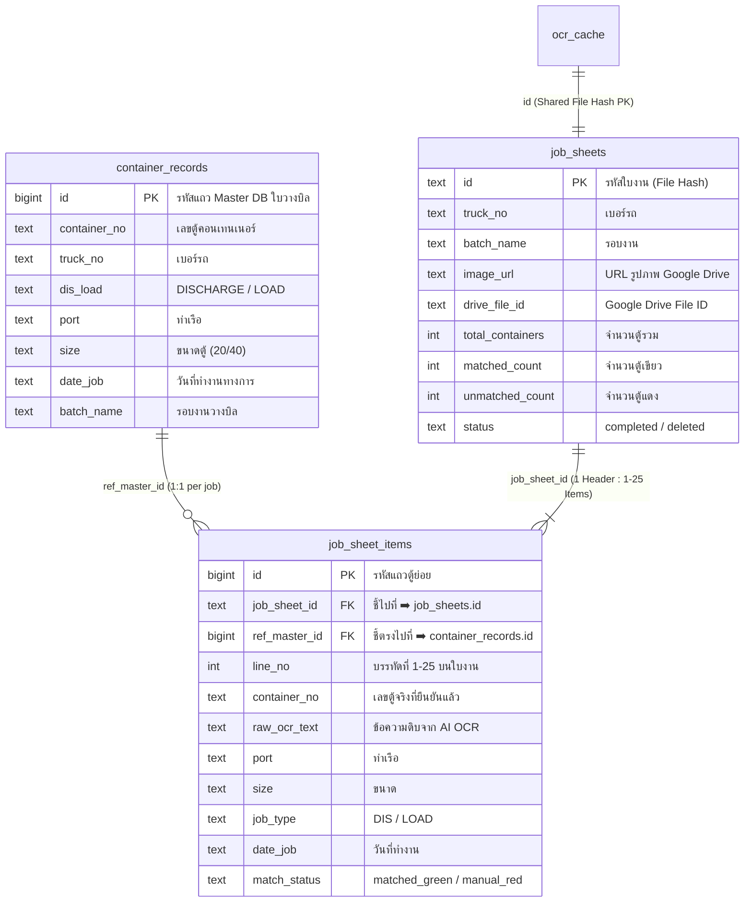
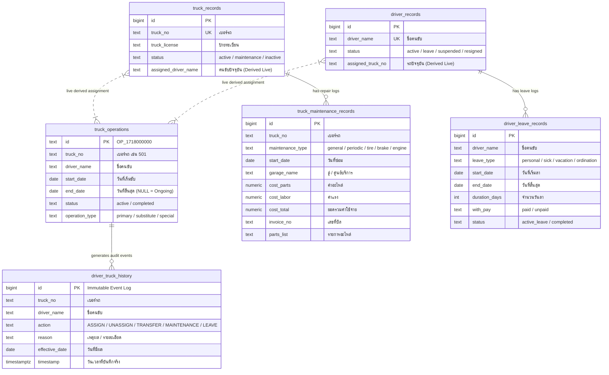

# Container OCR WebApp (V3) - Project Guide & Master Rules

เอกสารนี้คือคู่มือสรุปโครงสร้าง สถาปัตยกรรม กฎเหล็ก (Golden Rules) และแนวทางการพัฒนาของโปรเจค เพื่อให้ AI และทีมงานรักษามาตรฐานโค้ดได้อย่างถูกต้อง แม่นยำ และมีเสถียรภาพสูงสุด

---

## 📌 1. ภาพรวมโปรเจค (Project Overview)
โปรเจคนี้เป็นการอัปเกรดจาก **V2 (Python Desktop App)** มาเป็น **V3 (Web Application แบบเต็มตัว)** 
จุดประสงค์ของแอปคือ: นำ "ใบงานคนขับรถบรรทุก" มาสแกนด้วยเทคโนโลยี AI (Google Gemini) เพื่อดึงเลขตู้คอนเทนเนอร์และรายละเอียดต่างๆ แล้วนำมาเทียบ (Match) กับฐานข้อมูลงานหลัก (Master DB) พร้อมจัดระเบียบภาพขึ้น Google Drive และเก็บสถานะลงฐานข้อมูล Supabase

### 🛠 Tech Stack
- **Frontend:** React 19 + Vite (Vanilla CSS Tokens, No Tailwind)
- **Database:** Supabase (PostgreSQL + RLS)
- **AI OCR:** Google Gemini API (v1beta) - Multi-model fallback hierarchy
- **Cloud Storage:** Google Drive API (v3) + Supabase Hybrid Cache
- **Design System:** Custom Vanilla CSS + Slate Theme UI (ระบบดีไซน์เฉพาะ คมชัดระดับมืออาชีพ)

---

## ☁️ 2. สถาปัตยกรรมการจัดเก็บภาพ (Hybrid Storage Architecture)

```text
[ 1. ขั้นตอนอัปโหลด / คิวรอตรวจ (Pending Phase) ]
  ├── 🖼️ Supabase (ocr_cache):
  │     เก็บภาพ HD Data URL (Base64 JPEG max 1600px, 85% ~100KB) + Mini Thumbnail (160px ~5KB)
  │     👉 กฎเหล็ก: คนตรวจงานทุกคน (ชลบุรี/ทุกสาขา) เปิดดูรูปและตรวจงานได้ทันที 100% โดยไม่ต้องล็อกอิน Google!
  └── 📁 Google Drive:
        สำรองไฟล์ภาพเข้าโฟลเดอร์ Pending_Job_Sheets สำหรับเป็นไฟล์ต้นฉบับ

[ 2. ขั้นตอนบันทึกงานเสร็จสมบูรณ์ (Completed Phase) ]
  ├── 📄 Supabase (job_sheets - Header Table):
  │     บันทึกหัวใบงาน 1 แถวต่อ 1 ใบ (รอบงาน, เบอร์รถ, ลิงก์รูป Google Drive, ยอดตู้รวม, ตู้เขียว/แดง)
  ├── 📦 Supabase (job_sheet_items - Detail Table & ocr_records):
  │     บันทึกรายการตู้ 25 แถว ผูกด้วย job_sheet_id (เลขตู้, บรรทัดที่ 1-25, ท่าเรือ, ขนาด, ประเภท Dis/Load)
  ├── 📁 Google Drive Organization:
  │     ย้ายไฟล์จาก Pending_Job_Sheets ➡️ Completed_Job_Sheets / [ชื่อรอบงาน] / Truck_[เบอร์รถ]
  │     👉 ข้อดี: File ID และสิทธิ์เปิดดูคงเดิม 100% กดดูรูปย้อนหลังผ่านหน้า Completed ได้ตลอดเวลา
  └── 🗑️ Cleanup:
        อัปเดตสถานะใน ocr_cache เป็น 'completed' และตัดรูปชั่วคราวออกจากคิว Pending ป้องกันฐานข้อมูลบวม
```

---

## 🛑 3. กฎเหล็กของระบบ (Golden / Ironclad Rules)

### 🔴 กฎข้อที่ 1: การลบข้อมูลบน Supabase (RLS Soft-Deletion Rule)
- **ปัญหา:** ตาราง `ocr_cache` เปิดใช้งาน Row Level Security (RLS) สำหรับสิทธิ์ `anon` ซึ่งคำสั่ง `.delete()` จะถูกบล็อกอย่างเงียบๆ (ได้ HTTP 204 แต่ข้อมูลไม่ลบจริง)
- **ข้อปฏิบัติ:** **ห้ามยิง `.delete()` บนตาราง `ocr_cache` เด็ดขาด!** ให้ใช้คำสั่ง Soft-Update แทนเสมอ:
  ```javascript
  // ลบรายแถว หรือ ล้างคิวทั้งหมด
  await supabase.from('ocr_cache').update({ model_used: 'deleted', ocr_data: null }).eq('id', fileHash);
  ```
  และการดึงคิวงาน Pending ให้กรองด้วย `.eq('model_used', 'pending')`

### 🔴 กฎข้อที่ 2: การเข้าสู่ระบบ Google (Popup Blocker Rule)
- **ปัญหา:** เบราว์เซอร์จะบล็อกป๊อปอัป Google Login ทันทีหากคำสั่งถูกเรียกแบบ Asynchronous (หลัง `await` หรือใน callback)
- **ข้อปฏิบัติ:** คำสั่ง `handleGoogleAuthTrigger()` ต้องถูกเรียกแบบ **Synchronous ทันทีที่ผู้ใช้คลิกปุ่ม (User Click Event)** เช่น ใน `onClick` ของปุ่ม "☁️ อัปโหลดขึ้น Cloud" หากพบว่า Token หมดอายุ

### 🔴 กฎข้อที่ 3: บทบาทของ Google Token (Zero Login for Inspectors)
- **ผู้ตรวจงาน (Inspector / ชลบุรี):** **ไม่ต้องมี Token / ไม่ต้องล็อกอิน Google ใดๆ ทั้งสิ้น 100%** เปิดดูภาพ สแกน AI แก้ไขเลขตู้ และกดบันทึกได้ทันที
- **ผู้อัปโหลดงาน (Uploader):** เป็นคนเดียวที่ต้องมีสิทธิ์ Google เพื่อนำไฟล์ภาพต้นฉบับส่งขึ้นโฟลเดอร์ Google Drive ของบริษัท

### 🔴 กฎข้อที่ 4: การระบุเบอร์รถ (Truck No. Resolution Rule)
- **ข้อปฏิบัติ:** ระบบสามารถดึงเบอร์รถเบื้องต้นจากชื่อโฟลเดอร์มาแสดงเป็นค่าเริ่มต้น (Draft) ได้เพื่อความสะดวกรวดเร็ว แต่เมื่อ AI ทำการสแกนหัวใบงานแล้วพบเบอร์รถที่แท้จริง จะต้องนำผลสแกน AI (หรือการแก้ไขด้วยมือของผู้ใช้) มาอัปเดตเป็นค่าที่ถูกต้องสูงสุดเสมอ

---

## 🤖 4. กฎของ AI และลำดับโมเดล (Gemini OCR Free Tier)
1. **เวลาคืนโควต้า (Quota Reset Time):** โควต้าฟรีรีเซ็ตตรงเวลา **15:00 น. (เวลาไทย / GMT+7)** ทุกวัน (เที่ยงคืน Pacific Time)
2. **ลำดับการสลับโมเดล (Smart to Lite Fallback):**
   - `gemini-3.7-flash` ➡️ ตัวเก่งและแม่นยำที่สุด
   - `gemini-3.5-flash` ➡️ ความแม่นยำสูง
   - `gemini-3-flash-preview` ➡️ ตระกูล 3 Flash
   - `gemini-2.5-flash` ➡️ โมเดลมาตรฐาน
   - `gemini-3.1-flash-lite` ➡️ ตัวเบามาก **โควต้า 500 RPD** (ใช้รองรับงานจำนวนมาก)
   - `gemini-2.5-flash-lite` ➡️ สำรอง Lite
3. **การจัดการ Error:**
   - เจอ `429 Too Many Requests`: มาร์กแบนโมเดลนั้นจนถึง 15:00 น. แล้วสลับตัวถัดไป
   - เจอ `404` หรือ `503`: ข้ามไปโมเดลถัดไปทันที
   - **ห้ามส่งไฟล์ดิบ:** ก่อนส่งภาพให้ Gemini ต้องผ่านการย่อและบีบอัดความละเอียดผ่าน `<canvas>` ก่อนเสมอ

---

## 🧩 5. ระบบ Matching Logic ในหน้าตรวจเทียบใบงาน (Inspector Candidate Color Coding)
*(หมายเหตุ: ส่วนนี้คือสีของปุ่ม Candidate ในขั้นตอนตรวจใบงาน สำหรับ Badge สถานะกระทบยอดในหน้า Master DB ให้ดูหมวดที่ 12)*

สมองกลในการจับคู่เลขตู้กับตาราง `container_records` (Master DB):
- 🟢 **สีเขียว (Green):** แมตช์ 100% (เลขตู้ตรงเป๊ะ + ตู้ไม่ซ้ำในรอบงาน) ➡️ *Auto Select* (แสดง Candidate 1 ตัว)
- 🟣 / 🔵 **สีครามเด่นชัด (Distinct Indigo - Duplicate Auto-Resolved):**
  - **กรณีตู้ซ้ำในรอบงาน (Duplicate Dis/Load):** ขอบซ้ายหนา 6px สีม่วงคราม `#6366f1`, พื้นหลังสีคราม `#f5f3ff`, ป้ายสถานะ **`🔄 ซ้ำ Auto [Dis]`** หรือ **`🔄 ซ้ำ Auto [Load]`**, พร้อมป้ายกำกับอธิบาย `🔄 มี 2 งานใน DB • เลือกรอบ Dis ให้อัตโนมัติ` และแสดงปุ่มเลือกสลับงานของอีกรอบไว้ด้านล่าง
- 🔵 **สีฟ้า/น้ำเงิน (Blue):** แมตช์ความคล้ายสูง (High Similarity $\ge 85\%$) ➡️ *Auto Select & Auto Correct*
- 🟡 / 🟠 **สีเหลือง / ส้มแจ้งเตือนตู้ซ้ำ (Yellow / Amber Duplicate Alert):** 
  - **กรณีตู้ซ้ำที่ยังไม่รู้ประเภทงาน:** แสดงป้ายเตือนสีส้มเข้มเด่นชัด **`⚠️ ตู้ซ้ำ Dis/Load`** แตกปุ่ม Candidate ให้เลือกชัดเจนพร้อมป้าย **`📥 DIS`** (สีฟ้า) และ **`📤 LOAD`** (สีส้ม)
  - **กรณี Ambiguous:** มีตัวเลือกที่ใกล้เคียงหลายตู้ ➡️ *ผู้ใช้ต้องกดเลือกตัวเลือกที่ถูกต้อง* (คงข้อความดิบ OCR ไว้ 100% ไม่แทนค่าอัตโนมัติ)
- 🔴 **สีแดง (Red):** ไม่พบเลขตู้ที่ใกล้เคียงเลยใน Master DB ➡️ *ผู้ใช้ต้องพิมพ์ค้นหาหรือตรวจเช็คเอง*

---

## 📋 6. โครงสร้างหน้าตรวจเทียบใบงาน (Inspector View - VIEW B)

1. **ตรึง 25 แถวเสมอ (Fixed 25 Rows Standard):**
   - ตารางตรวจเทียบจะแสดง **ครบ 25 บรรทัด (`#1` ถึง `#25`) เสมอ 1:1** ตามฟอร์มกระดาษจริง
   - แถวที่ไม่มีข้อมูลจะแสดงเป็นสถานะ `⚪ ว่าง` ซึ่งสามารถคลิกเพื่อพิมพ์เพิ่มตู้ได้ทันที
2. **ระบบจัดการแถวขีดฆ่า (Strikethrough - Hover to Reveal):**
   - ปุ่ม `🚫 ขีดฆ่า` จะถูกซ่อนเพื่อความสะอาดตา และจะแสดงขึ้นมาเฉพาะตอนเลื่อนเมาส์ไปชี้แถวนั้น (Hover)
   - แถวที่ถูกขีดฆ่าจะแสดงเส้นคาดกลาง (`line-through`), ติดป้าย `🚫 ขีดฆ่า`, และ **ไม่ถูกนับเป็น Error ตู้แดง** ทำให้สามารถบันทึกจบงานได้
   - สามารถกดยกเลิกการขีดฆ่าได้ตลอดเวลาผ่านปุ่ม `↩️ เลิกขีดฆ่า`
3. **การกด Enter ในช่องเลขตู้ (Direct Value Commit & Auto-Focus):**
   - เมื่อพิมพ์เลขตู้และกด `Enter` ➡️ **ระบบจะบันทึกล็อคค่าที่พิมพ์ลงไปตรงๆ (ไม่เลือก Candidate ให้อัตโนมัติ)** เพื่อรองรับกรณีที่หาใน DB ไม่เจอและต้องการเก็บเป็นตู้ที่ยังไม่พบ (🔴 สีแดง)
   - หากต้องการเลือก Candidate ให้ใช้เมาส์คลิกที่ปุ่ม Candidate โดยตรง
   - เคอร์เซอร์จะเลื่อนลงไปยังช่องพิมพ์ของแถวถัดไปอัตโนมัติ ช่วยให้พิมพ์ตรวจงานได้อย่างต่อเนื่อง
4. **ปุ่ม "🔄 สแกนใหม่" (Cloud Rescan):**
   - ดึงไฟล์ภาพแบบหลายชั้น (Blob direct / Canvas / Direct Fetch / Google Drive API) เพื่อป้องกันปัญหา CORS
   - ล้างดราฟต์เดิมใน LocalStorage และเขียนทับข้อมูลชุดใหม่ลง Supabase Cloud (`ocr_cache`) ทันที 100%
5. **การจัดแนวตัวอักษรและระนาบสายตา 1:1 (Alignment & Monospace Baseline):**
   - ช่องพิมพ์เลขตู้ และข้อความ OCR ดั้งเดิมด้านล่าง ใช้ฟอนต์ Monospace ชุดเดียวกัน ขนาด `13px` หนา `800` ระยะห่างตัวอักษร `0.8px` เท่ากันเป๊ะ ตัวอักษรตรงแนวกันตัวต่อตัว
   - ปุ่ม Candidate #1, ช่องพิมพ์เลขตู้, แถบสถานะ, และลำดับ `#` จัดอยู่ในระนาบแนวนอนเดียวกันที่ความสูง `32px`
6. **โซนพรีวิวรูปภาพ (Slate Dark Canvas):**
   - แถบเมนูด้านบนรวม **กล่องฟิลเตอร์** และ **ปุ่มเซฟรูป** อยู่ในแถวเดียวที่ความสูง `42px` ระนาบเดียวกับตารางฝั่งขวา
   - พื้นหลังกรอบรูปใช้สี Slate Dark `#0f172a` เพิ่ม Contrast ให้เอกสารกระดาษสีขาวคมชัดอ่านง่าย

---

## 🛡️ 7. กฎเหล็กการแบ่งแยก Component ป้องกันบั๊กข้างเคียง (Component Isolation & Zero Side-Effects Rule)

เพื่อป้องกันไม่ให้การแก้ไขจุดหนึ่งไปทำให้ส่วนอื่นเสียหาย โค้ดในหน้าตรวจเทียบถูกแยกเป็นโมดูลอิสระ (Sub-components) ตามหลักการ **Single Responsibility Principle**:

```text
src/components/
├── ErrorBoundary.jsx        ⬅️ รับผิดชอบ: ดักจับและป้องกันอาการหน้าจอขาว (White Screen Shield)
└── inspector/
    ├── InspectorTopBar.jsx      ⬅️ รับผิดชอบ: แถบเมนูด้านบน (ย้อนกลับ / เบอร์รถ / รอบงาน / ปุ่มสแกนใหม่ / ปุ่มบันทึก)
    ├── ImagePreviewPanel.jsx    ⬅️ รับผิดชอบ: กล่องแสดงรูปภาพ + ฟิลเตอร์ + ปุ่มดาวน์โหลดรูป
    ├── InspectorTable.jsx       ⬅️ รับผิดชอบ: ตาราง 25 แถวตรวจเทียบ + แถบสรุปผลด้านบนตาราง
    └── CandidateButton.jsx      ⬅️ รับผิดชอบ: ปุ่ม Candidate แต่ละตัว + ธีมสี 5 ธีม (รวม DupGreen/Indigo)
```

### 🔒 กฎการแก้ไขโค้ด (Modification Rules):
1. **แก้เฉพาะไฟล์ที่รับผิดชอบ:**
   - แก้ไขแถบสถานะด้านบน ➡️ แก้ไขเฉพาะ `InspectorTopBar.jsx` **(ห้ามแตะไฟล์ตารางหรือรูปภาพ)**
   - แก้ไขการแสดงผลฟิลเตอร์/รูป ➡️ แก้ไขเฉพาะ `ImagePreviewPanel.jsx`
   - แก้ไขตารางตรวจเทียบ/บรรทัด ➡️ แก้ไขเฉพาะ `InspectorTable.jsx`
   - แก้ไขดีไซน์ปุ่ม Candidate ➡️ แก้ไขเฉพาะ `CandidateButton.jsx`
2. **การสื่อสารผ่าน Props Contract:**
   - ส่งผ่านข้อมูลด้วย Props และ Callback Functions เท่านั้น ห้ามแอบแก้ไข State ข้าม Component โดยตรง
3. **ตรวจสอบ Build ทุกครั้งหลังแก้ไข:**
   - ทุกครั้งที่มีการแก้โค้ด ต้องรัน `npm run build` ตรวจสอบความถูกต้องและ Syntax เสมอ

---

## 📦 8. หน้าประวัติใบงานที่บันทึกแล้ว (Completed Job Sheets - `BatchManagerView.jsx`)

1. **คอลัมน์ชื่อรูปภาพ (Image File Name):**
   - แสดงชื่อไฟล์ภาพจริง (เช่น `JobSheet_505_01.jpg`) พร้อมไอคอน `🖼️` สวยงาม
   - สามารถพิมพ์ชื่อไฟล์ภาพในช่องค้นหาเพื่อกรองหาใบงานได้ทันที
2. **ฟิลเตอร์เบอร์รถ & รอบงาน & ปุ่มล้างตัวกรอง:**
   - มี Dropdown **`🚚 ทุกเบอร์รถ`** และ **`📁 ทุกรอบงาน`**
   - เมื่อมีการเลือกตัวกรองใดๆ จะมีปุ่มสีแดง **`✕ ล้างตัวกรอง`** ปรากฏขึ้นเพื่อรีเซ็ตค่าทั้งหมดในคลิกเดียว
3. **ระบบแก้ไขตู้ค้างแยกเดี่ยว (Isolated Red Containers Editor):**
   - มีปุ่ม **`✏️ แก้ไขตู้ค้าง (N)`** เพื่อเปิด Modal แก้ไขเฉพาะตู้ที่ไม่พบใน DB โดย **ไม่กระทบกับตู้สีเขียวที่ยืนยันแล้ว**

---

## 📊 8.1 หน้าประวัติตู้จากการสแกน (OCR Container History - `OcrContainerHistoryView.jsx`)

1. **รวมข้อมูลระดับรายตู้ข้ามทุกรอบงาน (All Scanned Containers Log):**
   - แสดงรายการตู้ทั้งหมดที่ได้จากการทำ OCR ทั้งสถานะ `✅ Completed` (เสร็จแล้ว) และ `⏳ Pending Draft` (อยู่ในคิวรอตรวจ)
   - เชื่อมโยง Master DB แบบ Live Query: เมื่อมีการนำเข้า Master DB ใหม่ หรือจับคู่สำเร็จ ข้อมูลประเภทงาน ขนาด และท่าเรือจะอัปเดตตรงกับ Master DB อัตโนมัติทันที
2. **Interactive KPI & ล็อคระดับตัวเลข (Locked Baseline):**
   - มีการ์ดสรุปยอด 5 การ์ด (ตู้ทั้งหมด, บันทึกเสร็จแล้ว, กำลังรอตรวจ, ตรง DB ใบวางบิล, ยังไม่พบใน DB ใบวางบิล)
   - จัดวางแบบ Flex Column พร้อมล็อคความสูงหัวข้อ ตัวเลขขนาดใหญ่จะอยู่ในระนาบเดียวกันเป๊ะ 100% ทุกขนาดหน้าจอ
3. **ระบบ Pagination & ฟังก์ชัน Sort:**
   - แบ่งหน้าแสดงผลเริ่มต้น 50 รายการต่อหน้า พร้อมตัวเลือกปรับได้ (25, 50, 100, 200, All)
   - คลิกหัวตารางเพื่อเรียงลำดับ (Sort) ได้ทุกคอลัมน์ มีสัญลักษณ์บอกสถานะ (`▲`, `▼`, `↕`)
4. **ส่งออกไฟล์ Excel & ดูรูปภาพ:**
   - ปุ่ม **`📥 Export`** ดาวน์โหลดรายงานตู้ตามตัวกรองและลำดับการจัดเรียงจริงบนหน้าจอ
   - ปุ่ม **`🖼️ รูป`** เปิด Modal พรีวิวภาพใบงานต้นฉบับความละเอียดสูง

---

## 📐 8.2 กฎเหล็กมาตรฐานโครงสร้างตารางข้อมูลสากล (Universal Table Architecture Standard)

> **กฎเหล็กสำหรับทุกตารางข้อมูลในระบบ (ทั้งปัจจุบันและตารางใหม่ทั้งหมดในอนาคต):**

### 1. ลำดับเลย์เอาต์หน้าจอ 3 ชั้นมาตรฐาน (3-Tier Layout Hierarchy):
ทุกหน้าที่มีตารางข้อมูลจะต้องจัดโครงสร้างตามลำดับนี้เสมอ เพื่อให้ประสบการณ์ใช้งานเหมือนกันทุกหน้า:
```text
┌─────────────────────────────────────────────────────────────────────────┐
│ 1️⃣ Page Header & Actions Bar (Title 24px/800 + Subtitle + Action Buttons) │ (flexShrink: 0)
├─────────────────────────────────────────────────────────────────────────┤
│ 2️⃣ KPI Metric Summary Cards (การ์ดสรุปยอด 4-5 ใบ ล็อค Baseline ตัวเลข)    │ (flexShrink: 0)
├─────────────────────────────────────────────────────────────────────────┤
│ 3️⃣ Main Data Table Card (flex: 1, minHeight: 0, overflow: hidden, radius: 12px)│
│   ├── Filter & Search Bar (ค้นหา + Dropdowns + <ColumnVisibilityDropdown />)│ (flexShrink: 0)
│   ├── Table Scroll Area (flex: 1, minHeight: 0, overflow: auto)             │
│   │   └── <table> (tableLayout: 'fixed', thead sticky)                  │
│   └── Pagination Bar (X - Y จาก Z รายการ + Rows per page + ปุ่มเปลี่ยนหน้า) │ (flexShrink: 0)
└─────────────────────────────────────────────────────────────────────────┘
```

---

### 2. ขอบเขตความสูงและ Scrollbar แนวนอนแบบลอยตัว (Full Flexbox Standard):
- **ห้าม** ให้ตารางขยายความสูงจนหลุดหน้าต่างเว็บหลักเด็ดขาด (Zero Window Scroll)
- **โครงสร้าง CSS Flexbox มาตรฐานสำหรับทุกหน้าตาราง:**
  - Container หน้าหลัก: `display: 'flex', flexDirection: 'column', height: '100%', overflow: 'hidden'`
  - ส่วนหัว + การ์ด KPI + แถบกรอง: กำหนด `flexShrink: 0`
  - ตารางทำงาน (Table Scroll Area): กำหนด `flex: 1, minHeight: 0, overflow: 'auto'`
- **ผลลัพธ์:** แถบ Scrollbar แนวนอนจะลอยติดขอบล่างของตารางในระดับสายตาเสมอ 100% บนทุกขนาดหน้าจอ
- **Sticky Header:** กำหนด `<thead style={{ position: 'sticky', top: 0, zIndex: 10, background: '#f8fafc', borderBottom: '1px solid #e2e8f0' }}>` เพื่อให้หัวตารางลอยค้างเวลาเลื่อนดูแถวด้านล่าง

---

### 4. การนำเข้าและส่งออกข้อมูล (Bulk Import / Export):
- รองรับการ Import ไฟล์ Excel เข้าสู่ระบบเป็นชุด (Bulk Upsert)
- รองรับการ Export รายงาน Excel ตามผลการกรองและค้นหาจริงบนหน้าจอ

---

## 🗄️ 16. สถาปัตยกรรมฐานข้อมูลแบบ 2 เสาหลัก (Dual-Pillar Database & Direct ID Linking)

ระบบจัดเก็บและบริหารข้อมูลถูกแบ่งออกเป็น **2 เสาหลักอิสระ (Independent Pillars)** โดยเชื่อมโยงกันด้วย Primary Key ⟷ Foreign Key Direct Link:



1. **เสาที่ 1: ฝั่งใบวางบิล (`container_records` - Master DB):**
   - เป็น Single Source of Truth ของ **"ยอดงานทั้งหมดที่รถต้องวิ่ง"** (34 คอลัมน์)
   - ใช้เป็นฐานหลักในการคำนวณ KPI, ยอดรวมงานของรถแต่ละคัน, และยอดงานของคนขับ
2. **เสาที่ 2: ฝั่งใบงาน (`job_sheets` + `job_sheet_items`):**
   - เป็น Single Source of Truth ของ **"ผลการตรวจใบงานที่บันทึกจบแล้ว (Completed)"**
   - แต่ละตู้ใน `job_sheet_items` จะมีคอลัมน์ **`ref_master_id`** ชี้ตรงไปยัง `container_records.id` เพื่อระบุตัวตนแบบ 1:1 ชัดเจน
   - หากเป็นตู้แดงที่อยู่นอกใบวางบิล ค่า `ref_master_id` จะเป็น `NULL`
3. **การตัดการพึ่งพา `ocr_records` (Legacy Cleanup):**
   - โค้ดทั้งหมดในระบบอ่านและจัดการจาก `job_sheet_items` เป็นหลัก 100%

---

## 🎯 17. ระบบลำดับขั้นการจับคู่ตู้และการกระทบยอดอัตโนมัติ (6-Tier Hierarchy & Auto-Reconcile)

### 17.1 ลำดับขั้นการจับคู่ (Strict 6-Tier Disambiguation with Truck First)
เมื่อนำเลขตู้ไปเทียบกับ Master DB (ทั้งในหน้า Inspector, Modal แก้ไข, และ Auto-Reconciliation):
1. **🚚 ล็อคเบอร์รถก่อนเสมอ (Truck-First Strict):** ต้องเป็นงานของรถคันเดียวกันเท่านั้น หากไม่ระบุรถหรือไม่ตรงกับรถคันนี้ จะไม่เดาสุ่มข้ามคัน
2. **หากมีงานเดียวในรถคันนั้น:** แมตช์ทันที 🟢
3. **หากมีหลายงานในรถคันเดียวกัน (ตู้ซ้ำ Dis/Load / ต่างวัน):** ใช้ลำดับการตัดสินดังนี้:
   - ⭐️ **ระดับ 1:** `[เบอร์รถ]` + `[ประเภทงาน Dis/Load]` + `[ท่าเรือ]` + `[วันที่ Date Job]` *(ตรงครบ 4 มิติ)*
   - ⭐️ **ระดับ 2:** `[เบอร์รถ]` + `[ประเภทงาน Dis/Load]` + `[ท่าเรือ]`
   - ⭐️ **ระดับ 3:** `[เบอร์รถ]` + `[ประเภทงาน Dis/Load]` + `[วันที่ Date Job]`
   - ⭐️ **ระดับ 4:** `[เบอร์รถ]` + `[ประเภทงาน Dis/Load]`
   - ⭐️ **ระดับ 5:** `[เบอร์รถ]` + `[ท่าเรือ]`
   - ⭐️ **ระดับ 6:** `[เบอร์รถ]` + `[วันที่ Date Job]`
   - ⚠️ **หากไม่ตรงตามระดับใดเลย:** คืนค่า `null` เพื่อแจ้งเตือนให้ผู้ใช้ตรวจสอบด้วยมือ

> [!NOTE]
> **บทบาทของ `date_job` ในขั้นตอน OCR:** วันที่ถือเป็น **"ตัวช่วยเสริม (Bonus Filter)"** เท่านั้น ขั้นตอน OCR ไม่บังคับว่าต้องอ่านวันที่ได้ ระบบสามารถจับคู่อย่างแม่นยำผ่าน `[เบอร์รถ] + [Dis/Load] + [ท่าเรือ]` ได้ 100%

### 17.2 ระบบ Full Auto-Reconciliation (Auto Re-link & Heal)
เมื่อมีการล้างหรืออัปโหลดไฟล์ Excel ใบวางบิลรอบใหม่เข้ามา:
- ฟังก์ชัน `autoReconcileUnmatchedRecords()` จะทำงานอัตโนมัติ
- นำรายการตู้ทั้งหมดใน `job_sheet_items` มาเทียบกับ Master DB ชุดใหม่
- ทำการ **Re-link `ref_master_id`** ให้ชี้ไปยัง ID แถวใหม่ล่าสุดในฐานข้อมูล
- ทำการ **Auto-heal** เปลี่ยนตู้ที่เคยเป็นสีแดง (🔴) ให้กลายเป็นสีเขียว (🟢) อัตโนมัติ พร้อมอัปเดตยอดสรุปใน `job_sheets` ทันที

- **ขนาดฟอนต์หัวตาราง:** `fontSize: '13px'`, `fontWeight: 700`, `color: '#475569'` (เมื่อถูก Sort จะเปลี่ยนเป็น `#2563eb` พร้อมพื้นหลัง `#eff6ff`)
- **ระยะห่าง (Padding):** `10px 14px`
- **ฟีเจอร์ระดับ Excel ที่ต้องมีครบทุกตาราง:**
  1. 🔀 **Drag & Drop Reorder:** ลากสลับตำแหน่งหัวตารางได้อิสระ (`draggable`, `onDragStart`, `onDrop`)
  2. ↔️ **Border Resize Handle:** เส้นขอบขวาหนา `6px` ชี้แล้วเปลี่ยนเป็นสี `#2563eb` ลากเพื่อขยาย/ลดขนาดได้
  3. ⚡ **Double-Click Auto-fit:** ดับเบิ้ลคลิกหัวตารางหรือ Resize handle เพื่อยืดความกว้างให้พอดีกับข้อความที่ยาวที่สุด
  4. 📋 **Right-Click Context Menu:** คลิกขวาที่หัวตารางเพื่อเปิดเมนูคำสั่ง (เปลี่ยนชื่อ, ซ่อน, แสดงทั้งหมด, ปรับพอดี, คืนค่า)
  5. ✏️ **Rename Column Modal:** เปลี่ยนชื่อหัวคอลัมน์ผ่าน Pop-up Modal บันทึกลง `localStorage` และซิงค์ Supabase Global Aliases

---

### 4. มาตรฐานข้อมูลและฟอนต์ในแถวตาราง (`<td>` Standards):
- **ขนาดฟอนต์ข้อมูลทั่วไป:** `fontSize: '13px'`, `padding: '10px 14px'`, สี `#0f172a` หรือ `#334155`
- **สีแถวสลับ (Zebra Striping):** แถวคู่ `#ffffff` / แถวคี่ `#fcfdfd`, เมื่อชี้เมาส์ (Hover) ไฮไลต์เป็น `#f8fafc`
- **🔢 คอลัมน์เลขตู้คอนเทนเนอร์ (Container No):**
  - ต้องใช้ฟอนต์ Monospace เสมอ: `fontFamily: "'SF Mono', Consolas, Monaco, monospace"`, `fontWeight: 700`, `fontSize: '13px'`
- **🏷️ ป้ายประเภทงาน (DIS / LOAD Badges):**
  - ต้องมีขนาดกรอบเท่ากัน 100%: `minWidth: '52px'`, `justifyContent: 'center'`, `fontWeight: 800`, จัดกึ่งกลาง
  - **LOAD (สีส้ม):** `background: '#fff7ed'`, `color: '#c2410c'`, `border: '1px solid #fed7aa'`
  - **DIS (สีฟ้า):** `background: '#f0f9ff'`, `color: '#0369a1'`, `border: '1px solid #bae6fd'`
- **📅 วันที่และเวลา:** แสดงรูปแบบ `DD/MM/YYYY` หรือ `DD/MM/YYYY HH:mm` สะอาดตา (`fontSize: '12.5px'`, `color: '#475569'`)
- **🛡️ Text Overflow:** กำหนด `whiteSpace: 'nowrap'`, `overflow: 'hidden'`, `textOverflow: 'ellipsis'` ในทุกเซลล์

---

### 5. โมดูลและ Custom Hook กลางที่ต้องใช้ร่วมกัน (Universal Reusable Tooling):
ทุกหน้าที่สร้างตารางใหม่ จะต้องเรียกใช้เครื่องมือมาตรฐานเหล่านี้:
- **Hook จัดการคอลัมน์:** [`useColumnPreferences.js`](file:///C:/Users/AMD/Desktop/Container_V3_WebApp/src/hooks/useColumnPreferences.js) จัดการ Visibility, Reorder, Widths, Auto-fit, Context Menu, Aliases Sync
- **เมนูจัดการคอลัมน์:** [`ColumnVisibilityDropdown.jsx`](file:///C:/Users/AMD/Desktop/Container_V3_WebApp/src/components/ui/ColumnVisibilityDropdown.jsx) ปุ่ม `👁️ คอลัมน์` พร้อมปุ่ม `👁️ แสดงทั้งหมด`, `✏️` เปลี่ยนชื่อ, `🔄` รีเซ็ต
- **Context Menu กลาง:** [`TableContextMenu.jsx`](file:///C:/Users/AMD/Desktop/Container_V3_WebApp/src/components/ui/TableContextMenu.jsx)
- **Modal เปลี่ยนชื่อคอลัมน์:** [`RenameColumnModal.jsx`](file:///C:/Users/AMD/Desktop/Container_V3_WebApp/src/components/ui/RenameColumnModal.jsx)
- **Modal ดูรูปภาพ:** [`ContainerImageModal.jsx`](file:///C:/Users/AMD/Desktop/Container_V3_WebApp/src/components/containers/ContainerImageModal.jsx)

---

## 📁 9. โครงสร้างไฟล์สำคัญ (Key Files Summary)
- `src/config/navigationConfig.js`: จุดศูนย์กลางลงทะเบียนเมนูและ Routing ทั้งหมดของแอป (Single Source of Truth)
- `src/App.jsx`: Dynamic Route Resolver จัดการ State กลาง และครอบด้วย `ToastProvider` + `ErrorBoundary` แยกรายเมนู
- `src/components/Sidebar.jsx`: แถบเมนูด้านข้าง เรนเดอร์อัตโนมัติจาก `navigationConfig.js` 100%
- `src/context/ToastContext.jsx`: ระบบแจ้งเตือนมุมจอแบบ Global (เรียก `useToast()` ได้จากทุกหน้า)
- `src/components/ui/`: กล่องเครื่องมือ UI กลาง (`Toast.jsx`, `Badge.jsx`, `PageLayout.jsx`, `ColumnVisibilityDropdown.jsx`, `TableContextMenu.jsx`, `RenameColumnModal.jsx`)
- `src/components/containers/`: ชิ้นส่วนตารางจัดการ Master DB (`ContainerMasterTable.jsx`, `ContainerTableToolbar.jsx`, `ContainerKpiSummary.jsx`, `ContainerImageModal.jsx`)
- `src/components/inspector/`: ชิ้นส่วน UI ทั้งหมดของหน้าตรวจเทียบใบงาน (แยกอิสระ)
- `src/hooks/useColumnPreferences.js`: ฮุกจัดการคอลัมน์ระดับ Excel พร้อมเชื่อมต่อ Supabase Global Aliases
- `src/services/`: ชั้นรวมคำสั่งจัดการข้อมูลและ Supabase (`jobSheetService.js`, `containerService.js`)
- `src/views/ScannerView.jsx`: State Coordinator หลัก จัดการ Workflow หน้า Pending และประสานงาน Inspector
- `src/views/BatchManagerView.jsx`: ตรวจสอบประวัติรอบงานที่บันทึกแล้ว (ระดับเอกสารใบงาน)
- `src/views/OcrContainerHistoryView.jsx`: ประวัติตู้ทั้งหมดจากใบงาน (ระดับรายตู้ Completed & Pending)
- `src/views/DatabaseView.jsx`: นำเข้าและจัดการข้อมูล Excel/CSV Master DB ประจำวัน (34 คอลัมน์ + Reconciliation)
- `src/views/SettingsView.jsx`: ตั้งค่า API Keys และการเชื่อมต่อ
- `src/utils/matchingLogic.js`: อัลกอริทึมจับคู่เลขตู้ (Levenshtein Distance + Prefix Matching + Smart Dis/Load Resolution)
- `src/utils/googleDriveApi.js`: ระบบ OAuth และ API จัดการโฟลเดอร์/ไฟล์ Google Drive

---

## 🏛️ 10. สถาปัตยกรรมโมดูลาร์ & การเพิ่มเมนูใหม่ (Pluggable Navigation Architecture)

เพื่อรับประกันว่าการเพิ่มเมนูใหม่ในอนาคต (เช่น **Truck & Driver Expense**, **Fuel & Maintenance**, **Drivers DB**) จะไม่กระทบหรือทำให้เมนูเดิมเสียหาย:

### 🧩 หลักการ Plug-and-Play (3 ขั้นตอนในการเพิ่มเมนูใหม่):

1. **สร้างไฟล์ View ใหม่:**
   สร้าง Component หน้าจอใหม่ เช่น `src/views/expense/TruckExpenseView.jsx` (สามารถครอบด้วย `<PageLayout>` เพื่อมาตรฐานดีไซน์เดียวกัน)
2. **ลงทะเบียนใน Navigation Registry (`src/config/navigationConfig.js`):**
   เพิ่ม Object เมนูเข้าไปในหมวดหมู่ที่ต้องการ:
   ```javascript
   {
     id: 'truck-expenses',
     label: 'Truck Expenses',
     icon: '🚚',
     description: 'บันทึกและตรวจสอบค่าใช้จ่ายรถ',
     component: TruckExpenseView,
     defaultProps: {} // props เสริมถ้าต้องการ
   }
   ```
3. **เสร็จสิ้นทันที 100%:**
   ระบบ Sidebar และ Router ใน `App.jsx` จะแสดงผลและเปิดใช้งานเมนูใหม่ทันทีโดย **ไม่ต้องแก้ไขโค้ด `App.jsx` หรือ `Sidebar.jsx` แม้แต่บรรทัดเดียว!**

### 🍞 การเรียกใช้ระบบแจ้งเตือน Global Toast:
ในทุกคอมโพเนนต์ สามารถเรียกใช้งาน Toast ได้ทันที:
```javascript
import { useToast } from '../context/ToastContext';

export default function MyComponent() {
  const { success, error, warning, info } = useToast();
  
  const handleSave = () => {
    success('บันทึกข้อมูลเรียบร้อยแล้ว');
  };
}
```

---

## 🔌 11. สถาปัตยกรรมชั้นข้อมูล (Data Access / Service Layer)

แยก Business Logic และคำสั่ง Query ฐานข้อมูล Supabase ออกจากหน้าจอ (Views) ไปไว้ที่ `src/services/`:
- **`jobSheetService.js`:** จัดการคิวใบงาน Pending, การแคช OCR, การ Soft-Delete (ตามกฎเหล็ก RLS), และการบันทึกจบงาน Completed
- **`containerService.js`:** จัดการตาราง Master DB (`container_records`), นำเข้าไฟล์ Excel แบบ Chunk Batch, และบันทึกคอลัมน์ Aliases
- **กฎเหล็ก:** เมื่อสร้างเมนูใหม่ (เช่น `expenseService.js`) ให้สร้างฟังก์ชันเชื่อมต่อฐานข้อมูลไว้ในโฟลเดอร์ `src/services/` เสมอ เพื่อให้ง่ายต่อการแก้ไข schema และไม่กระทบกับ UI

---

## 📦 12. สถาปัตยกรรมเมนูจัดการตู้คอนเทนเนอร์ (Containers Master & Reconcile View)

หน้าจอ `DatabaseView.jsx` ทำหน้าที่เป็นศูนย์กลางฐานข้อมูลตู้คอนเทนเนอร์และกระทบยอด (Reconciliation) ระหว่าง Master Database กับผลการสแกน OCR:

1. **รองรับครบ 34 คอลัมน์ตามไฟล์วางบิล Excel ต้นฉบับ 100%:**
   - **กลุ่มข้อมูลหลัก (13 คอลัมน์):** `#`, `Container Number`, `สถานะจับคู่ (OCR)`, `รูปใบงาน`, `Dis / Load`, `Size`, `Date Job`, `Date ETA`, `Port`, `Time work`, `PLANNER`, `เลขรถ`, `ทะเบียน`, `ประเภทรถ`, `ชนิดรถ`, `Vessel`, `หมายเหตุ`, `รอบงาน (Batch)`, `ไฟล์ตั้งต้น`
   - **กลุ่มเวลาหน้างาน DISCHARGE (8 คอลัมน์):** `ออกจากลานจอด`, `ถึง GATE ที่ท่า`, `ถึง หน้าท่า`, `เวลาจับตู้`, `ถึง GATE DG`, `เวลาลงตู้`, `เวลาถึงลานจอด`, `Time Total Dis`
   - **กลุ่มเวลาหน้างาน LOAD (8 คอลัมน์):** `ออกจากลานจอด2`, `ถึงGATE DG`, `เวลาตู้ขึ้นหาง`, `ออกจากGATE DG`, `ถึง GATE ท่า`, `เวลาตู้ขึ้นเรือ`, `เวลาถึงลานจอด3`, `Time Total Load`
2. **สถานะการกระทบยอดจากมุมมองฐานข้อมูล Master (Perspective-Accurate Badges):**
   - **`🟢 พบในใบงาน` (`matched_green`):** มีใบงานสแกนครบถ้วนและข้อมูลตรงกับไฟล์วางบิล
   - **`🔵 พบในใบงาน (รถต่าง)` (`matched_blue`):** สแกนพบในใบงาน แต่เบอร์รถจริงไม่ตรงกับในไฟล์วางบิล
   - **`⚠️ ยังไม่มีใบงาน` (`missing`):** อยู่ในไฟล์วางบิล แต่ยังรอใบงานมาสแกน
   - **`🔴 สแกนนอกใบวางบิล` (`manual_red`):** สแกนพบจากใบงาน แต่นอกแผนวางบิล
   - **`🟣 ตู้ซ้ำ` (`duplicate`):** มีตู้เดียวกันทั้งรอบ Dis และ Load
3. **ระบบดาวน์โหลดรูปภาพ HD ตรงจาก Google Drive (`📥 โหลดรูป`):**
   - แปลง File ID เข้าสู่ Official Direct Export Endpoint (`https://drive.google.com/uc?export=download&id=[File_ID]`)
   - ป้องกันปัญหา Rate Limit 429 และปัญหาไฟล์โครงสร้าง HTML โดยดาวน์โหลดเป็นภาพ JPEG คมชัดขนาดเต็มลงเครื่องทันที
4. **ลำดับตัวเลขเรียงสะอาดตา (# Row Number Standard):**
   - คอลัมน์ `#` ทุกแท็บจะแสดงผลเป็นตัวเลขลำดับเรียง `1, 2, 3...` เสมอ โดยตัดรหัสภายในฐานข้อมูล (`legacy_...` หรือ UUID) ออกจากการแสดงผล

---

## 📅 13. มาตรฐานการจัดการวันที่และระบบแสดงผล (Date Normalization & Full Flexbox Architecture)

1. **มาตรฐานวันที่ ISO `YYYY-MM-DD` (Date Normalization System):**
   - ทุกวันที่ที่นำเข้าจาก Excel (`date_job`, `date_eta`) จะถูกแปลงผ่าน `normalizeExcelDate()` ให้กลายเป็นมาตรฐาน `YYYY-MM-DD` ทันที
   - รองรับทุกรูปแบบ: Excel Serial Number (เช่น `46113`), สตริงวันที่ (เช่น `15/Apr/2026`, `01/04/2026`), และปี พ.ศ. ไทย
   - หน้าจอแสดงผลมีระบบ **Auto-Format on the fly** แปลงเป็น `DD/MM/YYYY` (เช่น `15/04/2026`) ในตาราง และ `DD/MM/YY` (เช่น `15/04/26`) ในปุ่ม Candidate เสมอ
   - มีระบบ Fallback อัตโนมัติใน `fetchCompletedJobSheets()` และหน้าประวัติใบงาน แม้ใบงานจะถูกบันทึกก่อนมีคอลัมน์ `date_job` ก็จะดึงจาก Master DB มาแสดงให้อัตโนมัติ (ไม่เป็นค่าว่าง)

2. **ระบบเลย์เอาต์หน้าจอ Full Flexbox (Zero Window Scroll & Floating Horizontal Scrollbar):**
   - โครงสร้างหน้าจอหลัก (`App.jsx`) ถูกล็อคไว้ที่ `height: 100vh`, `overflow: hidden`
   - ส่วนประกอบด้านบน (Header, KPI Cards, Filter Toolbar) และด้านล่าง (Pagination) ถูกกำหนด `flexShrink: 0`
   - ตัวการ์ดและตารางทำงานใช้ `flex: 1`, `minHeight: 0`, `overflow: auto`
   - **ผลลัพธ์:** หน้าจอจะไม่มีการสไลด์แนวตั้งหลุดขอบจอ (Zero Window Scroll) และ **แถบ Scrollbar แนวนอนจะลอยติดขอบล่างของตารางในระดับสายตาเสมอ 100%** ในทุกขนาดหน้าจอ

3. **มาตรฐานดีไซน์ปุ่ม Candidate และตาราง (Minimalist UI Standard):**
   - **ปุ่ม Candidate:** ล็อคขนาดความกว้างเท่ากันเป๊ะทุกแถว (`435px`), จัดระยะห่างภายในกระชับ (`gap: 8px`), เปลี่ยนขนาดเป็น `Size 20` / `Size 40` ชัดเจน
   - **Clean Typography:** ตัดไอคอนปฏิทิน `📅` และไอคอนลูกศร `📥`/`📤` ออกจากทั้งปุ่ม Candidate และเซลล์ตารางทั้งหมดเพื่อความสะอาดตาและเป็นมืออาชีพสูงสุด

---

## 🎛️ 14. ระบบจัดการคอลัมน์และพิมพ์เขียวสำหรับเมนูใหม่ (Centralized Column Management & Core Blueprint)

ระบบตารางและส่วนติดต่อผู้ใช้ถูกสร้างเป็น **พิมพ์เขียวมาตรฐาน (Core Blueprint)** ที่เชื่อมโยงเป็นศูนย์กลาง (Centralized) สำหรับนำไปใช้กับทุกเมนู:

1. **ชื่อคอลัมน์เชื่อมถึงกันทุกหน้า (Global Column Aliases):**
   - จัดเก็บและซิงค์ชื่อคอลัมน์ผ่าน `column_aliases` บน Supabase และ LocalStorage รวมศูนย์
   - เมื่อผู้ใช้เปลี่ยนชื่อคอลัมน์ที่หน้าใดก็ตาม ทุกหน้าในระบบที่ใช้คอลัมน์เดียวกันจะอัปเดตชื่อใหม่ตามทันที
2. **คอมโพเนนต์เมนูจัดการคอลัมน์มาตรฐาน (`<ColumnVisibilityDropdown />`):**
   - คอมโพเนนต์กลาง `src/components/ui/ColumnVisibilityDropdown.jsx`
   - ฟังก์ชันครบถ้วน: ติ๊กเปิด/ปิดคอลัมน์, ปุ่มสีฟ้า `👁️ แสดงทั้งหมด (Unhide All)` อัตโนมัติเมื่อมีคอลัมน์ซ่อนอยู่, ปุ่มดินสอ `✏️` เปลี่ยนชื่อรายคอลัมน์, และปุ่ม `🔄 รีเซ็ตชื่อคอลัมน์ทั้งหมด`
3. **เมนูคลิกขวาที่หัวตารางมาตรฐาน (`<TableContextMenu />`):**
   - คอมโพเนนต์กลาง `src/components/ui/TableContextMenu.jsx`
   - รองรับการคลิกขวาที่หัวคอลัมน์ทุกหน้า: เปลี่ยนชื่อ (Rename), ดับเบิ้ลคลิก/ขยายพอดีข้อความ (Auto-fit), ซ่อนคอลัมน์ (Hide), ยกเลิกการซ่อนทั้งหมด (Unhide All), และคืนค่าขนาด/ลำดับเดิม
4. **มาตรฐานอนิเมชันการลากสลับคอลัมน์ (Smooth Animated Drag & Drop Standard):**
   - ทุกตารางต้องใช้ Event `onDragStart`, `onDragOver`, `onDragLeave`, `onDrop`, `onDragEnd` จาก `useColumnPreferences`
   - **ขณะลาก (`isDragging`):** `opacity: 0.4`, `transform: scale(0.97)`, `cursor: grabbing`
   - **ขณะลากผ่านเป้าหมาย (`isDragOver`):** `background: #eff6ff`, `borderLeft: 3px solid #2563eb`, `transform: translateX(2px)`
   - **ความนุ่มนวล:** `transition: background 0.18s cubic-bezier(0.4, 0, 0.2, 1), transform 0.18s cubic-bezier(0.4, 0, 0.2, 1), opacity 0.18s ease, border-left 0.15s ease`
5. **ฮุกควบคุมคอลัมน์ระดับ Excel (`useColumnPreferences.js`):**
   - ให้ความสามารถ Drag & Drop ลำดับคอลัมน์, คลิกลากปรับขนาดขอบคอลัมน์, และจำค่าแยกแต่ละหน้าจอได้ทันทีแบบ Plug & Play
6. **กฎเหล็กเรื่องค่าในเซลล์ (Clean Cell Typography):**
   - ห้ามใส่ไอคอนหรือ Emoji ภายในค่าของเซลล์ (เช่น ห้ามมี 🟢, 🏢, 👤, 🚛 ในเซลล์) หากต้องการไอคอนให้ใส่เฉพาะที่หัวคอลัมน์เท่านั้น
   - ปุ่มในคอลัมน์จัดการ (Actions) ให้ใช้ข้อความล้วนกระชับ เช่น `แก้ไข`, `ลบ` ไม่มีกรอบปุ่มหนาเทอะทะ

---

## 🚚 15. สถาปัตยกรรมระบบรถและคนขับ (Truck & Driver Fleet Architecture)

หมวดหมู่ `🚚 รถและคนขับ` แบ่งออกเป็น 2 เมนูย่อยตามหลักการแยกอิสระ (Decoupled Services & Views):

1. **ตารางฐานข้อมูล (`truck_records` & `driver_records`):**
   - **`truck_records`:** ทะเบียนรถ, ประเภทรถ, ชนิดตัวถัง, ยี่ห้อ, สถานะ (`active`/`maintenance`/`inactive`), คนขับประจำ, วันหมดอายุภาษี/พ.ร.บ./ประกันภัย
   - **`driver_records`:** ชื่อ-นามสกุล, เบอร์โทร, เลขบัตรประชาชน, เลขที่/ประเภทใบขับขี่, วันหมดอายุ, เบอร์รถประจำ, อัตราค่าเที่ยว, วันเริ่มงาน, ติดต่อฉุกเฉิน
2. **ระบบเชื่อมโยงคนขับและรถประจำอัตโนมัติ (Two-way Relationship Sync):**
   - เมื่อเลือกคนขับประจำในหน้าแก้ไขรถ ➡️ ระบบจะอัปเดตเบอร์รถประจำในทะเบียนคนขับให้อัตโนมัติ
   - เมื่อเลือกเบอร์รถประจำในหน้าแก้ไขคนขับ ➡️ ระบบจะอัปเดตชื่อคนขับในทะเบียนรถให้อัตโนมัติ
3. **การดึงสถิติงานจริง (Live Container/Job Performance):**
   - นับตามจำนวนรายการงาน/ตู้ที่เกิดขึ้นจริง (1 ตู้ = 1 งานจริง โดยหากเลขตู้เดิมถูกวิ่งซ้ำในหลายรอบงาน/หลายเที่ยว ให้นับแยกเป็นคนละงานตามรอบงานจริง) แสดงในคอลัมน์ **`จำนวนงาน (งาน)`** (หรือ `งานที่วิ่ง (ตู้)`) โดยตัดตัวนับใบงานกระดาษออกเพื่อความชัดเจน ไม่สับสน
4. **การนำเข้าและส่งออกข้อมูล (Bulk Import / Export):**
   - รองรับการ Import ไฟล์ Excel เข้าสู่ระบบเป็นชุด (Bulk Upsert)
   - รองรับการ Export รายงาน Excel ตามผลการกรองและค้นหาจริงบนหน้าจอ

---

## 🗄️ 16. สถาปัตยกรรมฐานข้อมูลแบบ 2 เสาหลัก (Dual-Pillar Database & Direct ID Linking)

ระบบจัดเก็บและบริหารข้อมูลถูกแบ่งออกเป็น **2 เสาหลักอิสระ (Independent Pillars)** โดยเชื่อมโยงกันด้วย Primary Key ⟷ Foreign Key Direct Link:


1. **เสาที่ 1: ฝั่งใบวางบิล (`container_records` - Master DB):**
   - เป็น Single Source of Truth ของ **"ยอดงานทั้งหมดที่รถต้องวิ่ง"** (34 คอลัมน์)
   - ใช้เป็นฐานหลักในการคำนวณ KPI, ยอดรวมงานของรถแต่ละคัน, และยอดงานของคนขับ
2. **เสาที่ 2: ฝั่งใบงาน (`job_sheets` + `job_sheet_items`):**
   - เป็น Single Source of Truth ของ **"ผลการตรวจใบงานที่บันทึกจบแล้ว (Completed)"**
   - แต่ละตู้ใน `job_sheet_items` จะมีคอลัมน์ **`ref_master_id`** ชี้ตรงไปยัง `container_records.id` เพื่อระบุตัวตนแบบ 1:1 ชัดเจน
   - หากเป็นตู้แดงที่อยู่นอกใบวางบิล ค่า `ref_master_id` จะเป็น `NULL`
3. **บทบาทของตาราง `ocr_records` (Archive & Backup Table):**
   - ระบบยังคง **บันทึกสำเนา (Sync-Write) ลงตาราง `ocr_records` คู่ขนานเสมอ** เพื่อเป็นประวัติและข้อมูลสำรองระยะยาว (Historical Backup Archive)
   - **ไม่นำมาใช้ในการคำนวณ:** ระบบจะไม่นำ `ocr_records` มาใช้ในการคำนวณ KPI, ยอดรถ, ยอดคนขับ, หรือการกระทบยอดใดๆ ทั้งสิ้น โดยการคำนวณทั้งหมดจะยึด `container_records` และ `job_sheet_items` เป็นหลัก 100%

---

## 🎯 17. ระบบลำดับขั้นการจับคู่ตู้และการกระทบยอดอัตโนมัติ (6-Tier Hierarchy & Auto-Reconcile)

### 17.1 ลำดับขั้นการจับคู่ (Strict 6-Tier Disambiguation with Truck First)
เมื่อนำเลขตู้ไปเทียบกับ Master DB (ทั้งในหน้า Inspector, Modal แก้ไข, และ Auto-Reconciliation):
1. **🚚 ล็อคเบอร์รถก่อนเสมอ (Truck-First Strict):** ต้องเป็นงานของรถคันเดียวกันเท่านั้น หากไม่ระบุรถหรือไม่ตรงกับรถคันนี้ จะไม่เดาสุ่มข้ามคัน
2. **หากมีงานเดียวในรถคันนั้น:** แมตช์ทันที 🟢
3. **หากมีหลายงานในรถคันเดียวกัน (ตู้ซ้ำ Dis/Load / ต่างวัน):** ใช้ลำดับการตัดสินดังนี้:
   - ⭐️ **ระดับ 1:** `[เบอร์รถ]` + `[ประเภทงาน Dis/Load]` + `[ท่าเรือ]` + `[วันที่ Date Job]` *(ตรงครบ 4 มิติ)*
   - ⭐️ **ระดับ 2:** `[เบอร์รถ]` + `[ประเภทงาน Dis/Load]` + `[ท่าเรือ]`
   - ⭐️ **ระดับ 3:** `[เบอร์รถ]` + `[ประเภทงาน Dis/Load]` + `[วันที่ Date Job]`
   - ⭐️ **ระดับ 4:** `[เบอร์รถ]` + `[ประเภทงาน Dis/Load]`
   - ⭐️ **ระดับ 5:** `[เบอร์รถ]` + `[ท่าเรือ]`
   - ⭐️ **ระดับ 6:** `[เบอร์รถ]` + `[วันที่ Date Job]`
   - ⚠️ **หากไม่ตรงตามระดับใดเลย:** คืนค่า `null` เพื่อแจ้งเตือนให้ผู้ใช้ตรวจสอบด้วยมือ

> [!NOTE]
> **บทบาทของ `date_job` ในขั้นตอน OCR:** วันที่ถือเป็น **"ตัวช่วยเสริม (Bonus Filter)"** เท่านั้น ขั้นตอน OCR ไม่บังคับว่าต้องอ่านวันที่ได้ ระบบสามารถจับคู่อย่างแม่นยำผ่าน `[เบอร์รถ] + [Dis/Load] + [ท่าเรือ]` ได้ 100%

### 17.2 ระบบ Full Auto-Reconciliation (Auto Re-link & Heal)
เมื่อมีการล้างหรืออัปโหลดไฟล์ Excel ใบวางบิลรอบใหม่เข้ามา:
- ฟังก์ชัน `autoReconcileUnmatchedRecords()` จะทำงานอัตโนมัติ
- นำรายการตู้ทั้งหมดใน `job_sheet_items` มาเทียบกับ Master DB ชุดใหม่
- ทำการ **Re-link `ref_master_id`** ให้ชี้ไปยัง ID แถวใหม่ล่าสุดในฐานข้อมูล
- ทำการ **Auto-heal** เปลี่ยนตู้ที่เคยเป็นสีแดง (🔴) ให้กลายเป็นสีเขียว (🟢) อัตโนมัติ พร้อมอัปเดตยอดสรุปใน `job_sheets` ทันที

---

## 🚚 18. สถาปัตยกรรมระบบบริหารกองรถและประวัติการปฏิบัติงาน (Fleet Management & Audit Trail Architecture V2.3)



### 18.1 การแบ่งแยกหน้าที่ของแต่ละตาราง (Separation of Concerns)
1. **`truck_operations` (Single Source of Truth ของการมอบหมาย):**
   - ควบคุมการจับคู่คนขับ-รถแบบ Live Real-time
   - เมื่อสร้างงวดใหม่ (`createOperation`): ระบบจะผูกคนขับกับรถ และสร้างบันทึก `🟢 เริ่มปฏิบัติงาน (ASSIGN)` ใน Timeline
   - เมื่อปิดงวดงาน (`closeOperation`): ระบบจะปลดคนขับ-รถ และสร้างบันทึก `🔴 สิ้นสุดการปฏิบัติงาน (UNASSIGN)` ใน Timeline
2. **`truck_records` และ `driver_records` (Master Assets & Personnel):**
   - เก็บข้อมูลทะเบียนรถ สภาพรถ ข้อมูลใบขับขี่ และสถานะความพร้อม (`active`, `maintenance`, `inactive`, `leave`, `resigned`)
   - ค่า `assigned_driver_name` และ `assigned_truck_no` จะถูกดึงสด (Live Derived) จาก `truck_operations` เสมอ เพื่อป้องกัน Ghost Assignment
3. **`truck_maintenance_records` (Decoupled Completed Ledger):**
   - สมุดบันทึกประวัติค่าใช้จ่ายการซ่อมบำรุงรถ (อะไหล่, ค่าแรง, บิล, อู่, เลขไมล์)
   - **แยกอิสระจากสถานะรถ 100%:** การบันทึกบิลซ่อมจะไม่ไปแทรกแซงหรือบังคับเปลี่ยนสถานะการวิ่งงานของรถ
4. **`driver_leave_records` (Driver Leave Ledger):**
   - สมุดบันทึกประวัติการลางาน (ลาป่วย, ลาพักร้อน, ลากิจ, ลาบวช) พร้อมสถิติจำนวนวันลาและการจ่ายค่าจ้าง
5. **`driver_truck_history` (Immutable Audit Trail & Timeline):**
   - สมุดบันทึกประวัติเหตุการณ์ย้อนหลัง (Event Log) ที่เก็บ Snapshot อิสระ
   - **คงอยู่ถาวร:** แม้จะล้างตารางการดำเนินงานหรือลบประวัติการลา ประวัติ Timeline ในตารางนี้จะยังคงอยู่ 100% เพื่อใช้เป็นหลักฐานตรวจสอบย้อนหลัง (จนกว่าจะกดปุ่ม `🧹 ล้างประวัติทั้งหมด` ในหน้านี้โดยตรง)

### 18.2 มาตรฐานระบบจัดการคอลัมน์กลาง (Unified Centralized Column Preferences)
ทุกตารางในหมวดหมู่รถและคนขับเชื่อมต่อกับ Hook `useColumnPreferences` และชุด Component กลางเหมือนกันทั้งหมด:
- 👁️ ปุ่มเลือกแสดง/ซ่อนคอลัมน์ (`ColumnVisibilityDropdown`)
- 🔀 ลากสลับตำแหน่งหัวคอลัมน์ (Drag & Drop Reorder)
- ↔️ ปรับความกว้างคอลัมน์แบบยืดหยุ่น (Resize Handle with `tableLayout: 'fixed'`)
- ⚡ ดับเบิ้ลคลิก Auto-fit ความกว้างตามเนื้อหา
- 🖱️ คลิกขวาตั้งชื่อเล่นคอลัมน์ (Rename Alias) และบันทึกลง LocalStorage อัตโนมัติ

### 18.3 ความสมบูรณ์ของฐานข้อมูล (Database Integrity & Constraints V2.3)
1. **Foreign Key Constraints (`ON UPDATE CASCADE`):**
   - `truck_operations(truck_no)` ➡️ `truck_records(truck_no)`
   - `truck_operations(driver_name)` ➡️ `driver_records(driver_name)`
   - `truck_maintenance_records(truck_no)` ➡️ `truck_records(truck_no)` (`ON DELETE CASCADE`)
   - `driver_leave_records(driver_name)` ➡️ `driver_records(driver_name)` (`ON DELETE CASCADE`)
2. **CHECK Constraints ควบคุมมาตรฐานสถานะ:**
   - `truck_records.status`: `('active', 'maintenance', 'inactive')`
   - `driver_records.status`: `('active', 'leave', 'inactive')`
   - `truck_operations.status`: `('active', 'completed')`
   - `truck_operations.operation_type`: `('primary', 'substitute', 'contract')`
   - `truck_maintenance_records.status`: `('in_progress', 'completed', 'cancelled')`
   - `driver_leave_records.status`: `('active_leave', 'completed', 'cancelled')`
3. **Automated Database Triggers:**
   - `trg_maintenance_cost_total`: รวมยอด `cost_total = cost_parts + cost_labor` ให้อัตโนมัติเมื่อเพิ่ม/แก้ไขบันทึกซ่อม
   - `trigger_set_updated_at`: อัปเดตฟิลด์ `updated_at = NOW()` ทุกครั้งที่มีการแก้ไขแถวข้อมูล
4. **Enhanced Atomic Stored Procedures (RPCs):**
   - `assign_driver_to_truck_rpc`: รองรับ `p_created_by` บันทึกชื่อผู้ทำรายการจริงลง Timeline Audit Log
   - `unassign_driver_truck_rpc`: ปลดคนขับ/รถแบบ atomic พร้อมบันทึก `p_created_by`

### 18.4 ระบบทดสอบฐานข้อมูลอัตโนมัติ (Automated DB Test Suite)
- มีสคริปต์ทดสอบสด `test_truck_driver_db.js` ตรวจสอบ 18 รายการ (Table Existence, RLS, Master Insert, Multi-table RPC, Transfer, Triggers, Cleanup)
- คำสั่งทดสอบ: `node test_truck_driver_db.js` (ผลทดสอบ 100% Pass)

---

## 🚀 19. มาตรฐานการเพิ่มประสิทธิภาพความเร็ว (High-Speed Data Fetching Standards V3)

เพื่อรักษาความเร็วในการเปิดหน้าจอให้ตอบสนองภายใน **< 400ms** เสมอ แม้ข้อมูลมีจำนวนมาก ให้ยึดหลักปฏิบัติดังนี้:

1. **Concurrent Parallel Requests (`Promise.all`):**
   - ห้ามยิงคำสั่ง `await` ต่อคิวกันแบบ Waterfall สำหรับตารางที่ไม่ได้มี Dependency ต่อกัน
   - ให้ยิงพร้อมกันคู่ขนาน เช่น ใน `DatabaseView`, `BatchManagerView`, และ `OcrContainerHistoryView` ให้ใช้ `Promise.all([ ... ])`
2. **Exclusion of Heavy Base64 Payloads (No Image Bloat on List Views):**
   - ตาราง `ocr_cache` เก็บภาพ Base64 JPEG เต็มไฟล์ (`image_data`) ซึ่งมีขนาดหลายร้อย KB ถึง MB
   - **กฎเหล็ก:** ในหน้าแสดงรายการตาราง (List/History Views) **ห้ามใช้ `.select('*')` บน `ocr_cache` เด็ดขาด!** ให้ระบุเฉพาะคอลัมน์ Metadata ที่ต้องการ เช่น `.select('id, image_name, ocr_data, model_used, created_at')`
3. **Selective Column Projection (ลดขนาด JSON):**
   - เมื่อดึง Master Database หรือ Detail Items ให้ระบุเฉพาะคอลัมน์ที่ใช้งานจริง เช่น `select('id, container_no, truck_no, port, size, dis_load, date_job, batch_name, source_file')`
4. **Master DB Sharing & In-Memory Map Lookup:**
   - หน้าจอที่มี Master Data อยู่แล้ว ให้ส่งต่อไปยัง Service ฟังก์ชัน (`existingMasterDb`) เพื่อตัดการ Query ซ้ำซ้อนไปยัง Supabase
   - ใช้ `Map` (Hash Map) สำหรับจับคู่เลขตู้แบบ $O(1)$ เสมอ เพื่อความรวดเร็วในการประมวลผลบน Client-side


