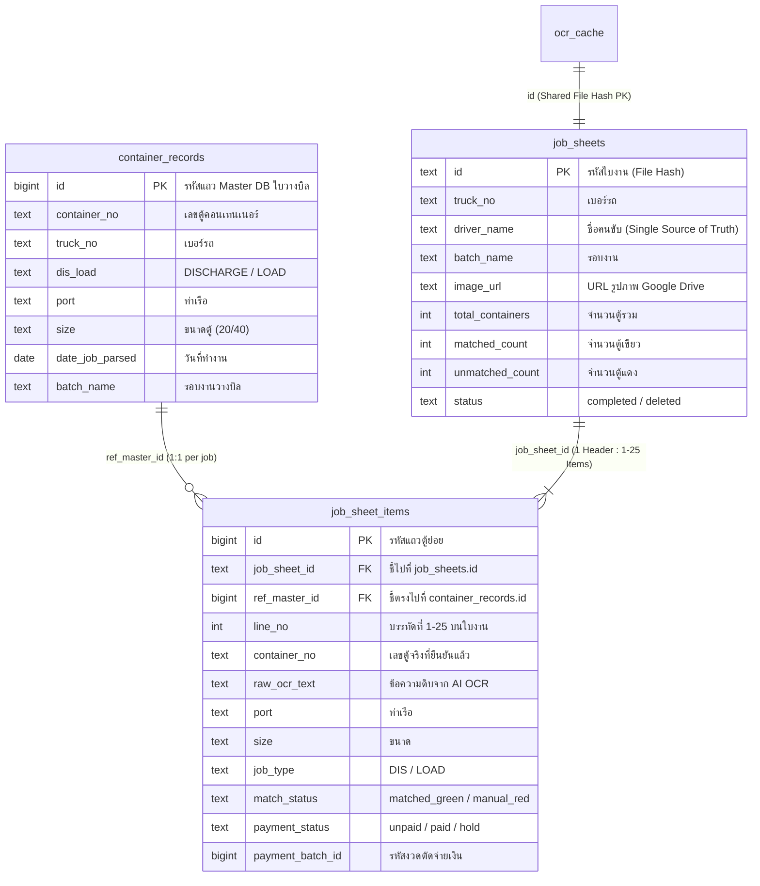
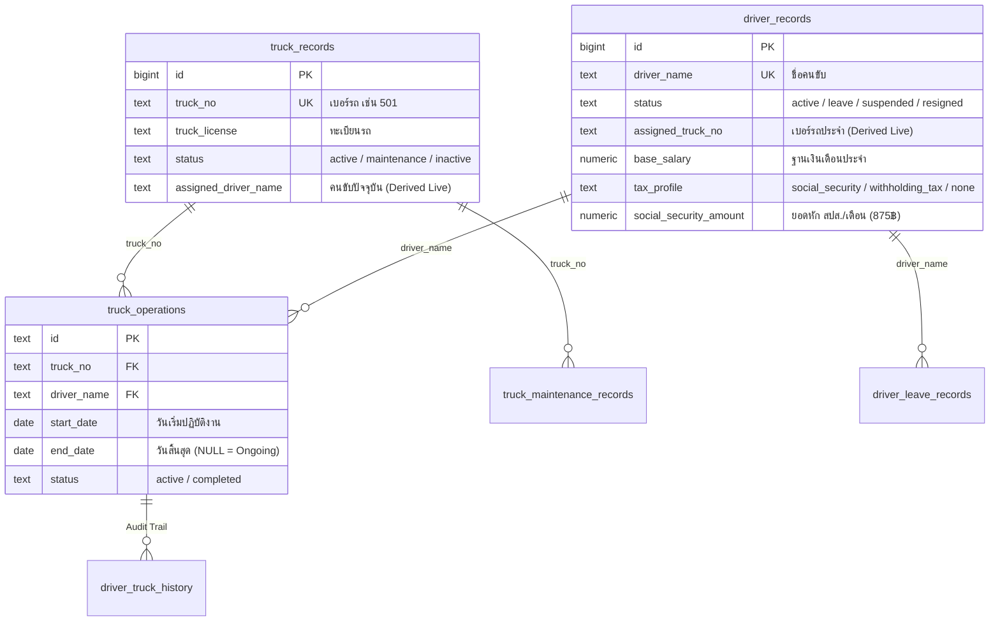

# Container OCR WebApp (V3) - Project Guide & Master Architecture

เอกสารนี้คือคู่มือสรุปโครงสร้าง สถาปัตยกรรม กฎเหล็ก (Golden Rules) และมาตรฐานการพัฒนาของระบบ เพื่อให้ AI และทีมงานรักษามาตรฐานโค้ดได้อย่างถูกต้อง แม่นยำ และมีเสถียรภาพสูงสุด

---

## 📌 1. ภาพรวมโปรเจกต์ (Project Overview)
ระบบเว็บแอปพลิเคชันจัดการโลจิสติกส์ตู้คอนเทนเนอร์แบบครบวงจร: สแกนใบงานคนขับรถบรรทุก (Truck Job Sheets) ด้วย AI (Google Gemini Vision), จับคู่เลขตู้กับฐานข้อมูลงานหลัก (Master DB) แบบ Real-time, จัดการข้อมูลรถและคนขับ, คำนวณค่ารอบและเงินเดือน, บันทึกค่าใช้จ่ายรถ และสำรองไฟล์ขึ้น Google Drive อย่างเป็นระบบ

### 🛠 Tech Stack
- **Frontend:** React 19 + Vite (Vanilla CSS Tokens, No Tailwind, Glassmorphism UI)
- **Database & Auth:** Supabase (PostgreSQL + RLS + Stored Procedures)
- **AI OCR:** Google Gemini API (v1beta) - Multi-model fallback hierarchy
- **Cloud Storage:** Google Drive API (v3) + Supabase Hybrid Cache
- **State & Preferences:** LocalStorage + Supabase Synced Preferences

---

## ☁️ 2. สถาปัตยกรรมการจัดเก็บภาพ (Hybrid Storage Architecture)

```text
[ 1. ขั้นตอนอัปโหลด / คิวรอตรวจ (Pending Phase) ]
  ├── 🖼️ Supabase (ocr_cache):
  │     เก็บภาพ HD Data URL (Base64 JPEG max 1600px, 85% ~100KB) + Mini Thumbnail (160px ~5KB)
  │     👉 กฎเหล็ก: คนตรวจงานทุกคน (ชลบุรี/ทุกสาขา) เปิดดูรูปและตรวจงานได้ทันที 100% โดยไม่ต้องล็อกอิน Google!
  └── 📁 Google Drive:
        สำรองไฟล์ภาพเข้าโฟลเดอร์ Pending_Job_Sheets สำหรับเป็นไฟล์ต้นฉบับ

[ 2. ขั้นตอนบันทึกงานเสร็จสมบูรณ์ (Completed Phase) ]
  ├── 📄 Supabase (job_sheets - Header Table):
  │     บันทึกหัวใบงาน 1 แถวต่อ 1 ใบ (รอบงาน, เบอร์รถ, คนขับ, ลิงก์รูป Google Drive, ยอดตู้รวม, ตู้เขียว/แดง)
  ├── 📦 Supabase (job_sheet_items - Detail Table):
  │     บันทึกรายการตู้ 25 แถว ผูกด้วย job_sheet_id (เลขตู้, บรรทัดที่ 1-25, ท่าเรือ, ขนาด, ประเภท Dis/Load, ref_master_id)
  ├── 📁 Google Drive Organization:
  │     ย้ายไฟล์จาก Pending_Job_Sheets ➡️ Completed_Job_Sheets / [ชื่อรอบงาน] / Truck_[เบอร์รถ]
  └── 🗑️ Cleanup:
        อัปเดตสถานะใน ocr_cache เป็น 'completed' และตัดรูปชั่วคราวออกจากคิว Pending ป้องกันฐานข้อมูลบวม
```

---

## 🛑 3. กฎเหล็กของระบบ (Golden Rules)

### 🔴 กฎข้อที่ 1: การลบข้อมูลบน Supabase (RLS Soft-Deletion Rule)
- ห้ามใช้คำสั่ง `.delete()` บนตาราง `ocr_cache` เด็ดขาด (เนื่องจากสิทธิ์ `anon` ภายใต้ RLS จะบล็อกการลบเงียบๆ)
- ให้ใช้คำสั่ง Soft-Update แทนเสมอ: `await supabase.from('ocr_cache').update({ model_used: 'deleted', ocr_data: null }).eq('id', fileHash);`
- การดึงคิวงาน Pending ให้กรองด้วย `.eq('model_used', 'pending')`

### 🔴 กฎข้อที่ 2: บทบาทของ Google Token (Zero Login for Inspectors)
- **ผู้ตรวจงาน (Inspectors / ทุกสาขา):** ไม่ต้องล็อกอิน Google ใดๆ ทั้งสิ้น เปิดดูภาพ สแกน AI แก้ไขเลขตู้ และบันทึกได้ทันที
- **ผู้อัปโหลดงาน (Uploader):** เป็นผู้ล็อกอิน Google Drive เพื่อส่งไฟล์ต้นฉบับเข้าโฟลเดอร์บริษัท
- **Popup Blocker:** ฟังก์ชัน Google Auth ต้องถูกเรียกแบบ Synchronous ทันทีที่ผู้ใช้คลิกปุ่ม (User Click Event)

### 🔴 กฎข้อที่ 3: สถาปัตยกรรม Database & Service Layer (DB-First Standards)
1. **DB-First Aggregation:** การคำนวณ Heavy Metrics / Payroll / KPI ต้องทำที่ PostgreSQL View หรือ RPC เสมอ (ห้ามดึงข้อมูลดิบมาวนลูปคำนวณใน Javascript เพื่อป้องกันปัญหา PostgREST 1,000-row limit)
2. **Mandatory Pagination:** การดึงตาราง Master, Logs, History ต้องมี Server-side Pagination (`.range()`) เสมอ
3. **Atomic Multi-Table Mutation:** การแก้ไขหรือเขียนข้อมูลที่กระทบ >= 2 ตาราง ต้องรวมเป็น Stored Procedure (RPC) เดียวแบบ All-or-Nothing
4. **No Client-Side Background Loops:** ห้ามใช้ `setTimeout` / Client loops วนลูปยิง UPDATE ซ่อม DB
5. **Strict Soft-Delete & Ledger Protection:** ตาราง Master/Ledger ต้องใช้ Soft-Delete และตั้ง Foreign Key เป็น `ON DELETE RESTRICT`

---

## 🤖 4. กฎของ AI และลำดับโมเดล (Gemini OCR Model Hierarchy)

1. **เวลาคืนโควต้า (Quota Reset Time):** โควต้าฟรีรีเซ็ตตรงเวลา **15:00 น. (GMT+7 / เวลาไทย)** ทุกวัน (เที่ยงคืน Pacific Time)
2. **ลำดับการสลับโมเดลอัตโนมัติ (Smart to Lite Fallback Hierarchy):**
   - 🥇 `gemini-3.7-flash`: โมเดลเรือธง ฉลาดและแม่นยำสูงสุด
   - 🥈 `gemini-3.5-flash`: โมเดลความแม่นยำสูงมาก รองรับงานสแกนซับซ้อน
   - 🥉 `gemini-3-flash-preview`: โมเดลตระกูล 3 Flash
   - 🏅 `gemini-2.5-flash`: โมเดลมาตรฐาน เสถียรและแม่นยำสูง
   - 🛡️ `gemini-3.1-flash-lite`: โมเดลน้ำหนักเบา ประมวลผลเร็ว **Limit: 500 RPD** (ตัวรับจบสำหรับงานปริมาณมาก)
   - 🛡️ `gemini-2.5-flash-lite`: โมเดลสำรอง Lite
   - 🛡️ `gemini-flash-lite-latest`: โมเดลสำรอง Lite ขั้นสุดท้าย
3. **การจัดการ Error & Auto-Ban:**
   - เจอ `429 Too Many Requests`: มาร์กแบนโมเดลนั้นใน LocalStorage จนถึง 15:00 น. แล้วสลับตัวถัดไป
   - เจอ `404` หรือ `503`: ข้ามไปโมเดลถัดไปทันที
   - **ห้ามส่งไฟล์ดิบ:** ก่อนส่งภาพให้ Gemini ต้องผ่านการย่อและบีบอัดความละเอียดผ่าน `<canvas>` ก่อนเสมอ

---

## 🧩 5. ระบบ Matching Logic ในหน้าตรวจเทียบใบงาน (Inspector View)

### 5.1 โค้ดสี Candidate (Inspector Candidate Color Coding)
- 🟢 **สีเขียว (Green):** แมตช์ 100% (เลขตู้ตรงเป๊ะ + ตู้ไม่ซ้ำในรอบงาน) ➡️ *Auto Select* (แสดง Candidate 1 ตัว)
- 🟣 / 🔵 **สีม่วงคราม (Distinct Indigo - Duplicate Auto-Resolved):**
  - กรณีตู้ซ้ำในรอบงาน (Duplicate Dis/Load): มีป้ายกำกับ **`🔄 ซ้ำ Auto [Dis]`** หรือ **`🔄 ซ้ำ Auto [Load]`** แสดงงานที่เลือกให้อัตโนมัติ พร้อมปุ่มเลือกสลับงานของอีกรอบ
- 🔵 **สีฟ้า/น้ำเงิน (Blue):** แมตช์ความคล้ายสูง (High Similarity >= 85%) ➡️ *Auto Select & Auto Correct*
- 🟡 / 🟠 **สีเหลือง/ส้ม (Yellow / Amber Duplicate Alert):**
  - กรณีตู้ซ้ำที่ยังไม่รู้ประเภทงาน: แสดงป้ายเตือน **`⚠️ ตู้ซ้ำ Dis/Load`** พร้อมป้าย **`📥 DIS`** (สีฟ้า) และ **`📤 LOAD`** (สีส้ม) ให้ผู้ใช้คลิกเลือก
  - กรณี Ambiguous: มีตัวเลือกใกล้เคียงหลายตู้ ➡️ คงข้อความดิบ OCR ไว้ ให้ผู้ใช้คลิกเลือก
- 🔴 **สีแดง (Red):** ไม่พบเลขตู้ใน Master DB ➡️ ผู้ใช้พิมพ์ค้นหาหรือตรวจเช็คเอง

### 5.2 โครงสร้างหน้าตรวจเทียบ (Inspector View Standards)
1. **ตรึง 25 แถวเสมอ (Fixed 25 Rows):** แสดงครบ 25 บรรทัด (`#1` ถึง `#25`) ตามฟอร์มกระดาษจริง แถวว่างแสดงสถานะ `⚪ ว่าง`
2. **ระบบขีดฆ่า (Hover-to-Reveal Strikethrough):** ปุ่ม `🚫 ขีดฆ่า` จะแสดงเมื่อเลื่อนเมาส์ชี้แถว แถวที่ขีดฆ่าจะไม่ถูกนับเป็น Error ตู้แดง
3. **การกด Enter ในช่องพิมพ์:** บันทึกล็อคค่าที่พิมพ์ลงไปตรงๆ (ไม่ Auto-select Candidate) และเลื่อน Cursor ลงแถวถัดไปอัตโนมัติ
4. **การจัดแนว Monospace 1:1:** ช่องพิมพ์และข้อความ OCR ดั้งเดิมใช้ฟอนต์ Monospace ชุดเดียวกัน ขนาด `13px` จัดระนาบแนวนอนเท่ากันเป๊ะ

---

## 🗄️ 6. สถาปัตยกรรมฐานข้อมูลแบบ 2 เสาหลัก (Dual-Pillar Database)



1. **เสาที่ 1: ฝั่งใบวางบิล (`container_records` - Master DB):** Single Source of Truth ของยอดงานที่รถต้องวิ่ง (Read-Only)
2. **เสาที่ 2: ฝั่งใบงาน (`job_sheets` + `job_sheet_items`):** Single Source of Truth ของผลการตรวจใบงานที่เสร็จสมบูรณ์แล้ว
3. **ลำดับขั้นการจับคู่ตู้ (Strict 6-Tier with Truck First):**
   - 🚚 ล็อคเบอร์รถก่อนเสมอ (Truck-First)
   - ระดับ 1: `[เบอร์รถ] + [Dis/Load] + [ท่าเรือ] + [วันที่]` (ตรงครบ 4 มิติ)
   - ระดับ 2: `[เบอร์รถ] + [Dis/Load] + [ท่าเรือ]`
   - ระดับ 3: `[เบอร์รถ] + [Dis/Load] + [วันที่]`
   - ระดับ 4: `[เบอร์รถ] + [Dis/Load]`
   - ระดับ 5: `[เบอร์รถ] + [ท่าเรือ]`
   - ระดับ 6: `[เบอร์รถ] + [วันที่]`
4. **Auto-Reconciliation:** ฟังก์ชัน `autoReconcileUnmatchedRecords()` จะ Re-link `ref_master_id` และ Auto-heal ตู้แดงเป็นตู้เขียวอัตโนมัติเมื่อมีการนำเข้า Master DB ใหม่

---

## 🚛 7. สถาปัตยกรรมรถและคนขับ (Fleet & Driver Management)



### กฎสำคัญ:
1. **1 Job Sheet = 1 Driver Consensus:** สิทธิ์ความเป็นเจ้าของงานยึดถือ **ใบงาน (Job Sheet) เป็นหลัก 100%** ตู้ทุกตู้ในใบงานเป็นผลงานของคนขับคนนั้น
2. **Seamless Transition (วันสิ้นสุด = วันเริ่มใหม่ - 1 วัน):** เมื่อมอบหมายคนขับใหม่ให้รถ ระบบจะปิดงวดเดิมอัตโนมัติโดยให้ `end_date` สิ้นสุดก่อนวันเริ่มใหม่ 1 วัน
3. **Derived Live Data:** ค่า `assigned_driver_name` และ `assigned_truck_no` ในตาราง Master ถูกคำนวณสดจาก `truck_operations` ป้องกัน Ghost Assignment

---

## 💰 8. ตารางบันทึกค่าใช้จ่ายรถ & ค่าน้ำมัน (Unified Truck Expenses Hub)

หน้าจอ `src/views/TruckExpensesView.jsx` ("💰 บันทึกค่าใช้จ่ายรถ & ค่าน้ำมัน") จัดการบันทึกและนำเข้าค่าใช้จ่ายของรถทุกคันและกองกลาง:

### 8.1 โครงสร้างฐานข้อมูลแบบคลีน (Simplified 17 Columns DB):
ตาราง `truck_expenses` ได้รับการจัดระเบียบให้มีเฉพาะ 17 ฟิลด์ที่ใช้งานจริง (ตัดฟิลด์ ค่าของ, ค่าแรง, เที่ยววิ่ง, ร้านค้า/อู่ ออกทั้งหมด):
- `id`, `expense_date`, `truck_no`, `driver_name`, `batch_name`, `category`, `description`, `amount_total`, `has_vat`, `vat_amount`, `payment_method`, `invoice_no`, `slip_url`, `remark`, `created_by`, `created_at`, `updated_at`

### 8.2 หมวดหมู่ค่าใช้จ่าย (Expense Categories):
1. ⛽ **`fuel` (ค่าน้ำมัน):** เติมน้ำมัน, ดีเซล
2. 🔧 **`maintenance` (ซ่อมบำรุง & อะไหล่):** ปะยาง, ซ่อมแอร์, ถ่ายน้ำมันเครื่อง, เปลี่ยนยาง
3. 🛣️ **`toll_port` (ค่าผ่านทาง / ผ่านท่า):** ผ่านท่า, ทางด่วน, สะพาน, ที่จอด
4. 💳 **`installment` (ค่างวดรถ & หาง):** ผ่อนรถ, ผ่อนหาง, ค่างวด
5. 📑 **`tax_insurance` (ภาษี & พ.ร.บ. & ประกัน):** ทะเบียน, พรบ, ประกัน, ตรวจสภาพ
6. 💸 **`salary` (เงินเดือน/ค่ารอบ):** เงินเดือน, ค่ารอบ, ค่าเที่ยว, เบิกค่าเที่ยว, จ่ายพนักงาน, เบี้ยเลี้ยง
7. 📦 **`misc` (อื่นๆ):** ค่าใช้จ่ายเบ็ดเตล็ดอื่นๆ

### 8.3 กฎการนำเข้า & ส่งออก Excel (Excel Sync Standards):
- **หัวคอลัมน์มาตรฐาน:** ใช้คำว่า **"หมวดหมู่ค่าใช้จ่าย"** (ภาษาไทย)
- **Auto-Detection:** ถ้าระบุหมวดหมู่เป็น `misc` หรือว่างไว้ ระบบจะสแกนชื่อรายการ (`description`) เพื่อจับคู่หมวดหมู่อัตโนมัติ

---

## 💵 9. ศูนย์รวมรายได้คนขับ & สมุดผลงานวิ่งงาน (Driver Income Master Ledger)

หน้าจอ `src/views/DriverPayrollView.jsx` ("💵 สรุปรายได้คนขับ") ทำหน้าที่เป็น **Master DB & Operational Ledger** สำหรับบันทึกและตรวจสอบผลงานวิ่งงานจริงของคนขับอย่างเสถียรและแม่นยำ 100% โดยแยกสโคปจากการตัดรอบเงินเดือน (ซึ่งจะทำในเมนู "ทำเงินเดือน" ในอนาคต):

```text
┌────────────────────────────────────────────────────────────────────────────────────────┐
│ 💵 สรุปรายได้คนขับ (Driver Operational Ledger)                                         │
├────────────────────────────────────────────────────────────────────────────────────────┤
│ [ 📦 สรุปผลงานวิ่งตู้ & ค่ารอบ ] ➔ แสดงตู้ที่ตรวจผ่าน (🟢) แยกกับตู้รอตรวจ (⏳)            │
│                                 คำนวณค่ารอบตามเรทขนาดตู้ (20'/40'/45') + โบนัสขั้นบันได   │
│ [ 💵 ทะเบียนคนขับ & ฐานเงินเดือน ] ➔ จัดการรายชื่อคนขับ, เบอร์รถประจำ, ฐานเงินเดือน, สปส., ภาษี  │
│ [ 💸 บัญชีเบิกล่วงหน้า & กู้ยืม ]  ➔ บันทึกเบิกงวดเดียว / ยืมเงินก้อนผ่อนชำระ + แนบสลิปโอนเงิน  │
│ [ ⚙️ เรทราคา & เงินพิเศษ ]       ➔ กำหนดเรทตู้ 20'/40'/45' ตามช่วงเวลา & ขั้นบันไดเงินพิเศษ  │
└────────────────────────────────────────────────────────────────────────────────────────┘
```

### กฎสำคัญและมาตรฐานข้อมูล (Data Integrity Standards):
1. **Strict Master DB Verified Matching:** 
   - คิดค่ารอบและเงินพิเศษเฉพาะตู้ที่แมตช์กับใบวางบิล Master DB (`container_records`) ผ่านแล้วเท่านั้น (`is_matched === true`)
   - ตู้แดงค้างตรวจ (`unmatched_red`, `manual_red`) หรือตู้ที่ยังไม่พบใน Master DB จะแสดงในคอลัมน์ **`⏳ รอตรวจ/รอแมตช์`** โดยไม่นำมารวมในยอดเงินสุทธิ
2. **Master DB Ground Truth (วันที่ & ขนาดตู้):** 
   - ใช้วันที่ (`date_job_parsed` / `date_job`), ขนาด (`size`), และท่าเรือ (`port`) จากใบวางบิล Master DB เป็นเกณฑ์หลักในการคำนวณช่วงเวลาและเรทราคา
3. **Incentive Bonus Tier (เกณฑ์เงินพิเศษขั้นบันได):**
   - `< 150` ตู้ = 0฿ | `150` ตู้ = 1,000฿ | `160` ตู้ = 2,000฿ | ... | `230` ตู้ = 9,000฿ | เกิน `230` ตู้ = +1,000฿ ทุกๆ 10 ตู้
4. **Tax & Deductions Profile (การตั้งค่าภาษี/เงินหัก):**
   - `social_security`: หักประกันสังคมอัตโนมัติ (มาตรฐาน **875฿**/เดือน หรือตามที่ระบุ)
   - `withholding_3pct`: หักภาษี ณ ที่จ่าย **3%** จากค่ารอบและเงินพิเศษ
   - `none`: ไม่หักภาษี/สปส.
5. **Driver Advance & Installment Loans (บัญชีเบิกล่วงหน้า/เงินกู้):**
   - `single_advance`: เบิกล่วงหน้างวดเดียว
   - `installment_loan`: ยืมเงินก้อนผ่อนชำระหลายงวด (ระบุจำนวนงวด, ยอดต่องวด, และงวดเริ่มต้น `start_period`)
   - รองรับการแนบสลิปโอนเงินและดูรูปสลิปแบบ Lightbox Modal
6. **High-Performance DB & Deadlock Protection (Migration 14):**
   - มี Composite Indexes ครอบคลุมการค้นหาเรทราคา, ใบงาน, ยอดเบิก, และ Master DB
   - การตัดรอบจ่ายใช้ Atomic Batch RPC (`mark_driver_containers_paid_rpc`) แบบ Set-Based Update ป้องกันปัญหา Deadlock 100%

---

## 📊 10. มาตรฐานระบบตารางข้อมูลสากล (Universal Table Grid Standards)

ทุกตารางข้อมูลในระบบ (Master DB, Job Sheets, Fleet, Payroll, Expenses) ต้องใช้สถาปัตยกรรมกลางชุดเดียวกัน:

### 10.1 โครงสร้างเลย์เอาต์ 3 ชั้น (3-Tier Layout Hierarchy):
1. **Tier 1 - Page Header & Action Buttons (`flexShrink: 0`)**
2. **Tier 2 - KPI Metric Summary Cards (`flexShrink: 0`):** การ์ดกะทัดรัดจัดระนาบ Baseline ตัวเลขตรงกัน 100%
3. **Tier 3 - Main Table Card (`flex: 1, minHeight: 0, overflow: 'hidden'`):**
   - Filter & Search Bar + `<ColumnVisibilityDropdown />`
   - Scrollable Viewport (`overflow: 'auto'`) ครอบ `<table>`
   - Pagination Footer (`flexShrink: 0`)

### 10.2 เครื่องมือและคอมโพเนนต์กลาง:
- **Hook `useColumnPreferences.js`:** จัดการ Visibility, Reorder, Widths, Auto-fit, Aliases, Sort
  - `autoFitOnMount = false` (รักษาระยะความกว้างเริ่มต้นมาตรฐาน ไม่ขยาย `#` เกินจำเป็น)
  - ล็อกขนาด `#` (ลำดับ) กะทัดรัดที่ 45px
- **`UniversalTableContainer.jsx`:** ครอบ Table Viewport + Context Menu + Rename Modal
- **`UniversalTableHeader.jsx`:** เส้นแบ่งหัวตารางชัดเจน + Hover ไฮไลต์สีน้ำเงิน + ดับเบิลคลิก Auto-fit + Drag Reorder
- **`ColumnVisibilityDropdown.jsx`:** ปุ่ม `👁️ คอลัมน์`, `⚡ Auto-fit ทั้งหมด`, `🔄 รีเซ็ตความกว้าง`, `🔀 รีเซ็ตลำดับ`

### 10.3 กฎการจัดแนวข้อความ (Alignment Convention):
- 👈 **ชิดซ้าย (Left):** ข้อมูลข้อความทั่วไป (ชื่อคนขับ, ท่าเรือ, หมายเหตุ, ทะเบียนรถ)
- ⏺️ **กึ่งกลาง (Center):** ลำดับ (`#`), เบอร์รถ, วันที่, ป้ายสถานะ (Badges), ปุ่มจัดการ (`Actions`)
- 👉 **ชิดขวา (Right):** ตัวเลขสถิติและจำนวนเงินทั้งหมด (จำนวนตู้, ค่ารอบ, ฐานเงินเดือน, ยอดสุทธิ)

---

## 🏛️ 11. สถาปัตยกรรม Pluggable Navigation & การเพิ่มเมนูใหม่

เมื่อต้องการเพิ่มเมนูใหม่ในระบบ:
1. สร้างไฟล์ View ใน `src/views/`
2. ลงทะเบียนใน Registry กลาง `src/config/navigationConfig.js`:
   ```javascript
   {
     id: 'menu-id',
     label: 'ชื่อเมนู',
     icon: '📦',
     description: 'คำอธิบายเมนู',
     component: MyNewView
   }
   ```
3. ระบบ Sidebar และ Routing ใน `App.jsx` จะเรนเดอร์และเปิดใช้งานเมนูใหม่ทันที 100% โดยไม่ต้องแก้ไขโค้ด Router กลาง

---

## 🧪 12. การทดสอบและการ Build (Quality Assurance)
ก่อนส่งมอบงานหรือ Deploy ขึ้น Cloud ต้องรันคำสั่งตรวจสอบ:
```bash
# รันชุดทดสอบคำนวณค่าตอบแทน, ค่าใช้จ่าย และฐานข้อมูล
node tests/test_incentives_and_expenses.js
node tests/test_payroll_tax_advances.js
node test_truck_driver_db.js

# รัน Production Build ตรวจสอบ Syntax และ Bundler
npm run build
```
